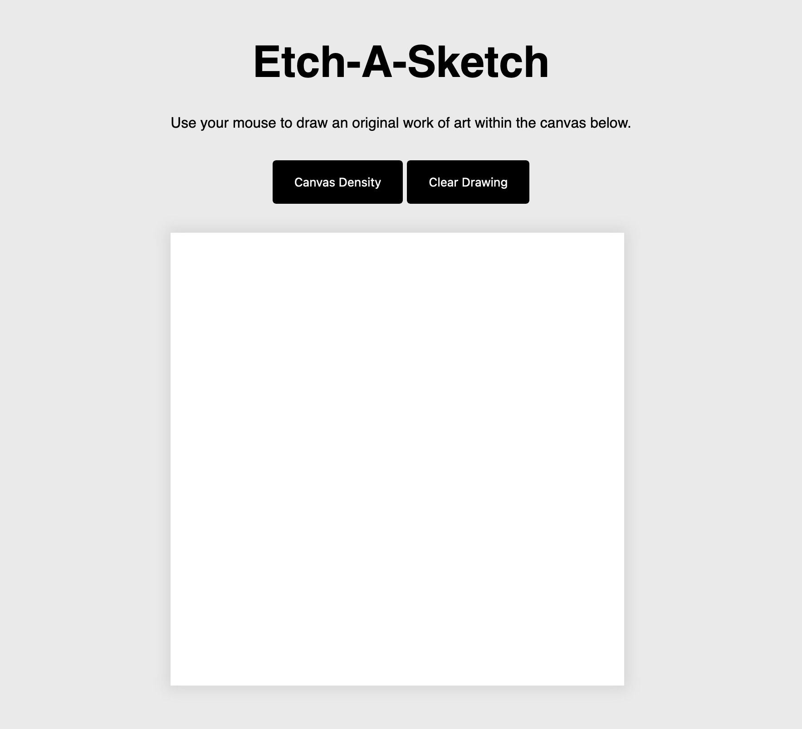

# Etch-a-Sketch

This is a solution to the [The ODIN project](https://www.theodinproject.com/lessons/foundations-etch-a-sketch). The ODIN Project is an online platform that offers a comprehensive, free web development curriculum. It provides learners with a structured path to acquire skills in web development, including coding, programming, and building projects, through interactive lessons and real-world challenges.

## Table of contents

- [Overview](#overview)
  - [The challenge](#the-challenge)
  - [Screenshot](#screenshot)
  - [Links](#links)
- [My process](#my-process)
  - [Built with](#built-with)
  - [What I learned](#what-i-learned)
  - [Continued development](#continued-development)
  - [Useful resources](#useful-resources)
- [Author](#author)


## Overview

### The challenge

Users should be able to:
- Input how many squares per side they want for the canvas (kind of like pexil density)
- Use their mouse to draw on the canvas

### Screenshot



### Links

- Solution URL: [Add solution URL here](https://your-solution-url.com)
- Live Site URL: [Add live site URL here](https://your-live-site-url.com)

## My process

### Built with

- Vanilla Javascript
- Flexbox
- HTML
- CSS

### What I learned

This was a fun challenge. It was daunting at first sight but it didn't take me as long as I thought it would. One bit that I learned was the use of `this` in HTML event handlers. To draw on the canvase I needed to add an eventlistener that looped through all of the divs to create the mouseover effect. `This` then allowed me to apply the style to individual divs. See code snippet below:
```js
function draw() {
    for(i = 0; i < squares.length; i++){
    squares[i].addEventListener('mouseover', function (){
        this.style.backgroundColor = "#000"
    } )
}}
```

### Continued development

Per usual, I had to do some researching to get my program to work. One area I would like to get more confortable with is iterating over HTML Collections. I tried using `forEach` but since it's not an array I don't think that I can use that method. I've used it before when manipulating the DOM so I'm not exactly sure why I couldn't this time. I need to learn when I can use `forEach` or a `for loop` to iterate.


### Useful resources

- [www.geeksforgeeks.org](https://www.geeksforgeeks.org/remove-all-the-child-elements-of-a-dom-node-in-javascript/) - This helped me figure out how to remove all of the child elements from a parent element. It was necessary to remove the child divs after the user inputed their desired canvas density. 

## Author

- Website - [Ashley Rogers](https://www.finalfinalv1.com)


